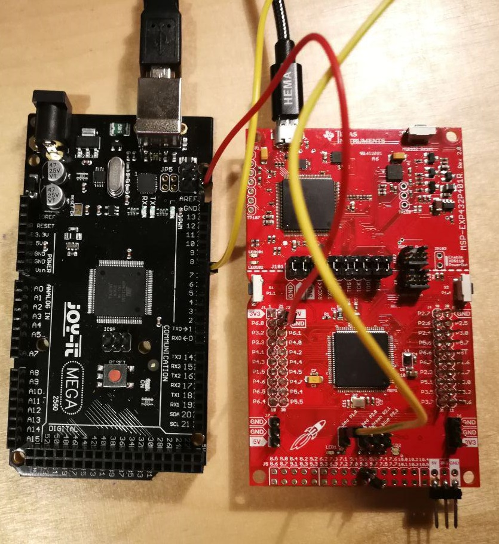
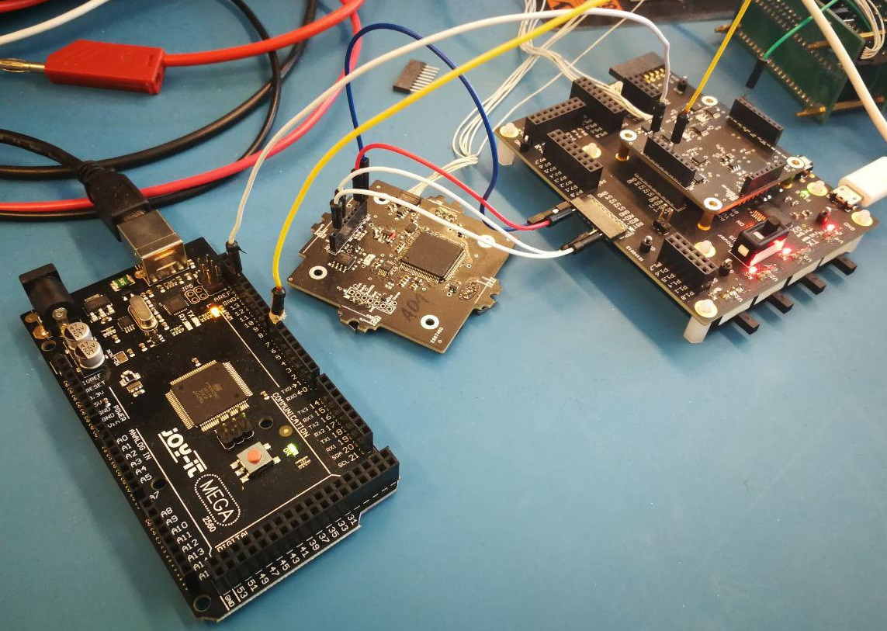

# Delfi-PQ - Intergration testing

## Purpose

Delfi-PQ belongs to the new type of miniaturized satellites, namely PocketQube satellites, which exhibit certain advantages over the widely used CubeSats. Due to their smaller size, PocketQubes bring a decrease in total cost and development time. The main objective of Delfi-PQ is to test the application of a PocketQube satellite for future missions since it is expected that the reduced development cycle will allow a comparably higher launch frequency, increasing flight experience and reliability of the system.

To ensure that the respective subsystems are operational, the integration of the Delfi-PQ system must be tested. While in space, the functionality of a subsystem cannot be observed directly and positive feedback from the subsystem itself does not guarantee a faultless execution of the specified task. Additionally, the subsystem hardware itself is not able to detect if the execution was in fact successful. Hence, it is necessary to deploy verification through external hardware if the command given to the subsystem was effectively executed.

This project will focus on the design and implementation of a solution for verifying the successful execution of a command given to the subsystem. In particular, the verification of the LED command to the LaunchPad (Texas Instruments) is demonstrated via external hardware (Arduino Mega). Thereafter, the same logic is applied in order the verify the power bus command to the ADB of Delfi-PQ. The provided software is intended to be modified easily in order to adapt the integration testing to different subsystems of the Delfi-PQ.

## Repository overview
Besides this README file, the repository includes the following files:
- **arduino_feedback.ino**: Arduino script that must be uploaded to the Arduino board
- **client_LED.py**: Python script with UI to change the state of the LED
- **client_ADB.py**: Python script with UI to change the state of the ADB power (?????????)
- **client_ADB_noUI.py**: Python script without UI to change the state of the ADB power (?????????)
- **pq_comms.py**: Python script that converts the commands of the client scripts into messages that are sent to the board

## Literature background

### Integration testing

### ADB

## Design

The overall purpose of this project is to do integration testing of the Delfi-PQ subsystems. To do so, first the interaction between the PC and a SimpleLink™ MSP432P401R LaunchPad, which emulates the on-board software, is tested. This is done by plugging an Arduino to the PC and connect one of its GPIO ports to the LaunchPad. This way the commands are tested both with the subsystem feedback (either by printing it in the terminal or by using the EGSE software) and with the external hardware feedback.

### Arduino 

The Arduino script is the simplest one. It updates every second in the Serial Monitor the value that is read in the GPIO that is connected to the LaunchPad. The Serial Monitor is later interpreted by the python scripts, which in their turn use such values

#### Arduino block diagram


### Python

#### Python block diagrams


so I was thinking of having something that says every 5/10 seconds: The LED is ON (like, if serial reads 1, print this)

if the user sets it to off and it's on, it says: Error, the output is not what was chosen. Log file saved; then it saves a file with the time, with what was chosen and what it read


tell the user what to do
exit program press control C
use there commands: led on of

get user input
thread 1
use user input
turn on -> turn led on
turn off -> turn led off


thread 2
check Arduino serial,
compare to user input


if error
a log file will be saved, saves error
and saves comment


## How to use

### Required hardware

In order to use the scripts provided in this repository, the user will need the following hardware items: 
- **SimpleLink™ MSP432P401R LaunchPad**: Communicates with the python scripts and is simulating the Delfi-PQ subsystem
- **Arduino (UNO, MEGA, etc.)**: Used as the external hardware 
- **Wires and Breadboard**: To connect the LaunchPad and Arduino





### Software implementation

#### ```client_LED.py```

Libraries needed: ```numpy```, ```Pyserial```,(...) - in the 'import' section)

Commands: 

- **0,1,2,... followed by ENTER**: Chooses the Arduino port
- **0/1 followed by ENTER**: Sends a command to turn OFF/ON the LED
- **CTRL+c followed by ENTER**: Exits the program

First, run the EGSE software. This Java software should be in a local folder, and it runs by writing:
```
java -........ 
```
in the terminal. After making sure the connection and emulation of the LaunchPad board is established (this can be verified by opening the browser in ```localhost:8080```), run the python script as:
```
python client_LED.py localhost:8080
```
*NOTE: the last two commands should be executed with terminal running in the respective folders where the invoked files exist. Else, simply replacing the files names by the full directory should suffice.*

A message of how to utilise the program will appear:

```
Welcome to...
(...)
Choose Arduino port (0,1,2,...): 
```

Choose the port that connects the Arduino to the PC.

*NOTE: The Arduino board has to be connected in the format of ```/dev/ttyACM(...)```, else the program does not recognise it. In case the connection to the PC has a different designation, change line (XXXXX) of ```client_LED.py``` to the specific designation (for example, ```COM(...)```)*

If the connection is established, the program will attempt to connect to the LaunchPad board. This is represented by a progress bar that looks like the following:
```
[###       ]
```
Each ```#``` represents a successful ping with the DEBUG subsystem of the board. 

Finally, the program is ready to take commands to turn ON and OFF the LED. Every 10 seconds (after the first user input) an update on the Arduino feedback is printed on the screen. Every time a user inputs 1/0 (+ENTER), the message that is sent to the board is printed. If there is feedback from the board, the following should appear:
```
Command received from DEBUG
```
Additionally, an immediate Arduino feedback check is performed.

Anytime the Arduino disagrees with the subsystem feedback, an ERROR message is saved in an external .log file.

*FINAL REMARKS: This program is protected such that if any undesired input exists, a 'try again' type of notification is printed; The ```ENTER``` command after ```CTRL+c``` is required because there is an existing thread that contains the function ```input()``` that stalls the program. The waiting period is demanded such that existing ```time.sleep()``` functions cease.*

#### ```client_ADB.py```

#### ```client_ADB_noUI.py```

## Results

## Issues encountered

- The connection between LaunchPad and EGSE was not always established. The only remedy was to kill the EGSE instance and rerun it until it worked.

- The LaunchPad LED P1.0 GPIO connection burned and the LED was constantly ON when plugged in. This was remedied by manually connecting/disconnecting the cable accordingly (or not) to the user input.


## Future changes and recommendations
- Instead of connecting to the LED, this can be used to verify the funcionality of another Delfi-PQ subsystem

- ?

